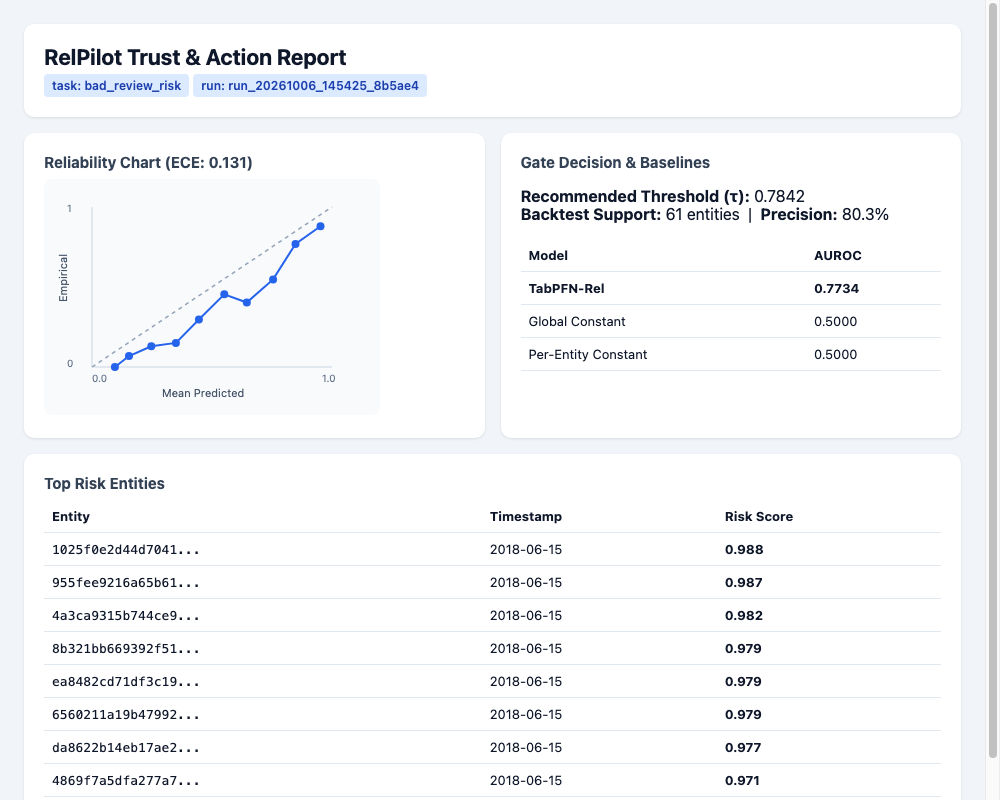

# RelPilot

> **"Ask your database about the future. The agent acts only where the model has proven it deserves trust."**

RelPilot is a Model Context Protocol (MCP) server plus a Gemini CLI agent that makes zero-shot predictions over multi-table relational databases using **TabPFN-Rel** (hosted TabPFN-3.5 API).

RelPilot requires:
- **No manual SQL joins**
- **No hand-crafted feature engineering**
- **No lookahead target leakage**

An autonomous agent acts on predictions **ONLY** where an empirical temporal backtest proves the model achieves the required precision target with statistical support.

<p align="center">
  
</p>

---

## 1. Ten-Minute Quickstart

RelPilot is built exclusively with Python 3.12 and [`uv`](https://docs.astral.sh/uv/).

### Prerequisites

Install `uv` (if not already installed):
```bash
curl -LsSf https://astral.sh/uv/install.sh | sh
```

### Setup

1. **Clone the repository**:
   ```bash
   git clone https://github.com/aniketkharad/relpilot.git
   cd relpilot
   ```

2. **Configure Environment Keys**:
   ```bash
   cp .env.example .env
   ```
   Edit `.env` to supply your API credentials:
   ```dotenv
   GEMINI_API_KEY=your_gemini_api_key_here
   TABPFN_TOKEN=your_tabpfn_token_here
   GEMINI_MODEL=gemini-3.8-flash
   ```

3. **Install Dependencies**:
   ```bash
   uv sync
   ```

4. **Run Unit Tests (Offline, Mocks, No Network)**:
   ```bash
   uv run pytest tests/
   ```

5. **Offline Sample Replay (Zero API Token Cost)**:
   Judges can instantly inspect the committed sample run without requiring API keys:
   ```bash
   # Generate self-contained HTML Trust Report
   uv run python -m relpilot.report runs/demo_run
   ```

6. **Verify Data Tables for Workspace (Optional)**:
   ```bash
   uv run python scripts/prepare_data.py
   ```

7. **Run the Scripted End-to-End Demo (Requires Live APIs)**:
   ```bash
   uv run --env-file .env python -m relpilot.demo
   ```

8. **Launch the Interactive Gemini CLI REPL**:
   ```bash
   uv run --env-file .env relpilot
   ```

9. **Run as an MCP Stdio Server**:
   ```bash
   uv run --env-file .env relpilot-server
   ```

---

## 2. Environment Variables (`.env`)

| Variable | Required | Description |
| :--- | :---: | :--- |
| `GEMINI_API_KEY` | Yes | Google GenAI API key (from [Google AI Studio](https://aistudio.google.com/)). |
| `TABPFN_TOKEN` | Yes | Prior Labs API token (from [ux.priorlabs.ai](https://ux.priorlabs.ai)). |
| `GEMINI_MODEL` | No | Default: `gemini-3.8-flash` (or `gemini-3.5-flash`). |
| `RELPILOT_WORKSPACE` | No | Path to active workspace folder (default: `workspaces/demo`). |
| `RELPILOT_RUNS_DIR` | No | Directory where run artifacts are stored (default: `runs`). |
| `RELPILOT_OUTBOX` | No | Path to audit trail file for proposed actions (default: `outbox.jsonl`). |

---

## 3. How to Add a Workspace, Task, and Skill

RelPilot workspaces are self-contained folders describing a database, its prediction tasks, and agent operational playbooks:

```
workspaces/<workspace_name>/
  data/                   # CSV or Parquet data tables
    sellers.csv
    orders.csv
    order_items.csv
  schema.yaml             # Primary keys, foreign keys, event time columns
  tasks/                  # Declarative prediction tasks (Community Unit 1)
    bad_review_risk.yaml
  skills/                 # Agent playbooks in Markdown (Community Unit 2)
    acting-on-predictions.md
```

### Step 1: Create `schema.yaml`

Define table paths, primary keys (`pkey`), event time columns (`time_col`), and foreign key relationships (`fkeys`):

```yaml
sellers:
  pkey: seller_id
  path: sellers.csv
  columns: [seller_id, seller_city, seller_state]

orders:
  pkey: order_id
  time_col: order_purchase_timestamp
  path: orders.csv
  columns: [order_id, customer_id, order_purchase_timestamp]

order_items:
  time_col: purchase_ts
  path: order_items.csv
  fkeys:
    order_id: orders
    seller_id: sellers
  columns: [order_id, seller_id, price, purchase_ts]
```

### Step 2: Create a Task (`tasks/<task_name>.yaml`)

A task defines the entity table, cutoffs, and a DuckDB SQL query computing the forward-looking target:

```yaml
database: ../schema.yaml

entity_table: sellers
entity_col: seller_id
time_col: timestamp
target_col: bad_review_risk
task_type: binary_classification

timedelta: 30 days
num_eval_timestamps: 1
val_timestamp: '2018-05-15 00:00:00'
test_timestamp: '2018-06-15 00:00:00'

query: |
  SELECT timestamp, seller_id,
    CAST(EXISTS (
      SELECT 1 FROM order_items
      JOIN order_reviews ON order_items.order_id = order_reviews.order_id
      WHERE order_items.seller_id = sellers.seller_id
        AND order_items.purchase_ts > timestamp
        AND order_items.purchase_ts <= timestamp + INTERVAL '{timedelta}'
        AND order_reviews.review_score <= 2
    ) AS INTEGER) AS bad_review_risk
  FROM timestamp_df, sellers
  WHERE EXISTS (
      SELECT 1 FROM order_items
      WHERE order_items.seller_id = sellers.seller_id
        AND purchase_ts > timestamp - INTERVAL '{timedelta}'
        AND purchase_ts <= timestamp
  )
```

### Step 3: Create an Agent Skill (`skills/<skill_name>.md`)

Skills are Markdown guides explaining operational procedures or business actions to the agent:

```markdown
# Playbook: Responding to Seller Review Risk

When `bad_review_risk` generates entities with confidence >= threshold:
1. Trigger QA outreach with packaging guidelines.
2. Flag seller for 14-day fulfillment monitoring.
```

---

## 4. MCP Tools (5)

RelPilot exposes 5 tools over stdio conforming to the Model Context Protocol:

1. `describe_workspace()`: Returns compact JSON with tables, columns, foreign keys, time columns, tasks, and skills.
2. `read_skill(name: str)`: Returns the text content of a skill playbook.
3. `run_task(task: str, model="tabpfn-rel-client-latest", cutoff=None)`: Fits TabPFN-Rel on historical data, backtests on the latest labelled period, predicts live entities, writes artifacts to `runs/<id>/`, and returns a compact trust report plus top-K entities.
4. `trust_report(run_id: str)`: Retrieves discrimination metrics (AUROC vs. naive baselines), Expected Calibration Error (ECE), precision@k, and the recommended act-threshold.
5. `propose_actions(run_id: str, action: str, min_precision=0.8)`: The Gate. Entities above the backtest threshold are queued in `outbox.jsonl` with status `proposed`. Entities below threshold go to `needs_review` with explicit confidence shortfall explanations.

---

## 5. MCP Client Configuration Snippets

### Claude Desktop

Add to `~/Library/Application Support/Claude/claude_desktop_config.json` (macOS) or `%APPDATA%\Claude\claude_desktop_config.json` (Windows):

```json
{
  "mcpServers": {
    "relpilot": {
      "command": "uv",
      "args": [
        "--directory",
        "/absolute/path/to/relpilot",
        "run",
        "--env-file",
        ".env",
        "python",
        "-m",
        "relpilot.server"
      ]
    }
  }
}
```
*(Config syntax verified against Anthropic MCP specifications; untested in headless test runner).*

### Cursor

Add to your project root under `.cursor/mcp.json`:

```json
{
  "mcpServers": {
    "relpilot": {
      "command": "uv",
      "args": [
        "--directory",
        "/absolute/path/to/relpilot",
        "run",
        "--env-file",
        ".env",
        "python",
        "-m",
        "relpilot.server"
      ]
    }
  }
}
```
*(Config syntax verified against Cursor MCP specifications; untested in headless test runner).*

### Gemini CLI (Built-in)

RelPilot includes a built-in Gemini CLI agent:

```bash
uv run --env-file .env python -m relpilot.agent
```
*(Verified live end-to-end with tool calling).*

---

## 6. Quota & Metering Notes

- **API Limits**: Config defaults cap requests to `MAX_TRAIN_ENTITIES=2000`, `MAX_PREDICT_ENTITIES=500`, and `MAX_GEMINI_CALLS_PER_SESSION=30`.
- **Token Pricing**: TabPFN-3.5 charges based on rows and columns with a minimum charge of **10,000 tokens** per billable call.
- **Zero-Cost Baselines**: `constant-global` and `constant-per-entity` run strictly in-process at **zero API token cost**.

---

## 7. What is Deliberately NOT Built

Per architectural scope decisions in `AGENTS.md`:
- **No Web UI**: RelPilot is headless (MCP stdio server and CLI REPL).
- **No Free-Form SQL Tool**: Prevents data leakage and arbitrary database tampering.
- **No Authentication Layer**: Assumed to run locally in a trusted container or environment.
- **No Direct BigQuery / Postgres Live Connectors**: Tables are ingested via CSV/Parquet file exports.
- **No Direct External Webhooks**: Autonomous proposals are recorded in `outbox.jsonl` for human auditing rather than directly dispatching irreversible API requests.

---

## 8. License

- **RelPilot Code**: Released under the [MIT License](LICENSE).
- **TabPFN-Rel & TabPFN-3.5 API**: Subject to Prior Labs terms of service and model licenses. See [Prior Labs Documentation](https://docs.priorlabs.ai/) and [PriorLabs/tabpfn-rel](https://github.com/PriorLabs/tabpfn-rel).
